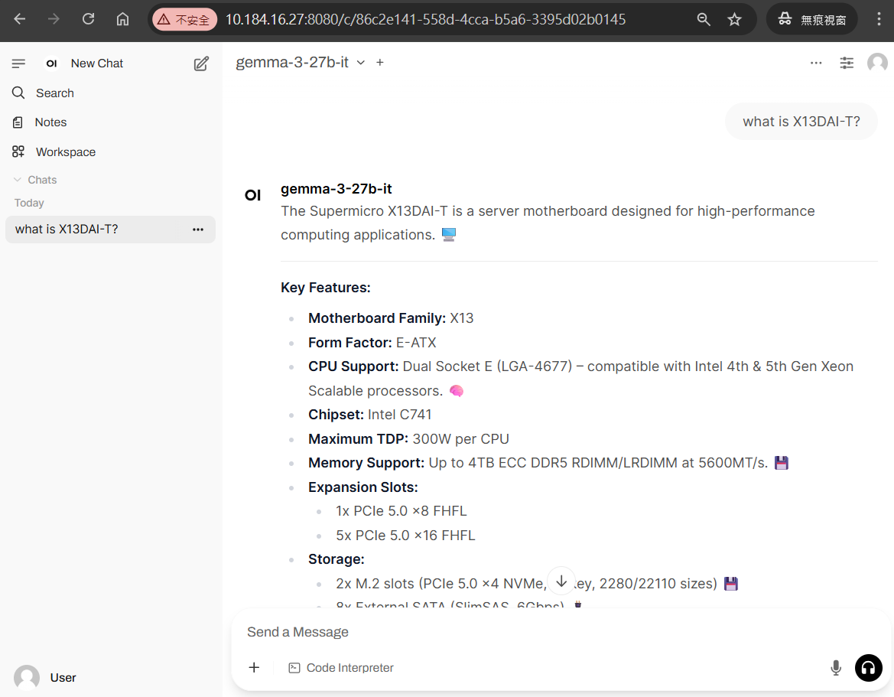

# SuperQueryWise AI

## Project Description

This project is a multi-turn conversational AI system built with FastAPI and a LangGraph state machine architecture.  
It integrates a local large language model service (VLLM API), Redis caching, Qdrant vector search, and multi-source query routing to enable efficient semantic parsing, sub-question decomposition, database retrieval, and final answer generation.  
Designed for scenarios like product specification lookup and technical support Q&A, it provides real-time streaming chat responses.

 

## Frontend Example

Below is an example screenshot of the integrated frontend interface — **Open WebUI**:  

Open WebUI is an open-source web-based chat interface that seamlessly connects to this backend API, supporting the standard OpenAI chat format and streaming responses for a smooth and interactive user experience.
 

## Core Workflow

1. **Frontend Input**  
   User inputs queries in Open WebUI, which sends OpenAI chat-format requests to the backend endpoint `/v1/chat/completions`.

2. **Semantic Parsing & Decomposition**  
   The Pipeline in `core.py` first checks Redis cache and Qdrant vector database for existing semantic parse results; if missing or insufficient, it calls the VLLM API to perform semantic analysis and sub-question decomposition.

3. **Sub-question Classification & Routing**  
   Each decomposed sub-question is asynchronously routed to appropriate search modules based on its `query_sources` property: Spec vector search, FAQ vector search, Graph database query, or verified component lookup.

4. **Answer Aggregation**  
   After all queries return results, the Pipeline uses the VLLM API to merge sub-answers into a final response.

5. **Streaming Response**  
   The backend supports Server-Sent Events (SSE) streaming responses to allow Open WebUI to display answers token-by-token in real time.

 
 